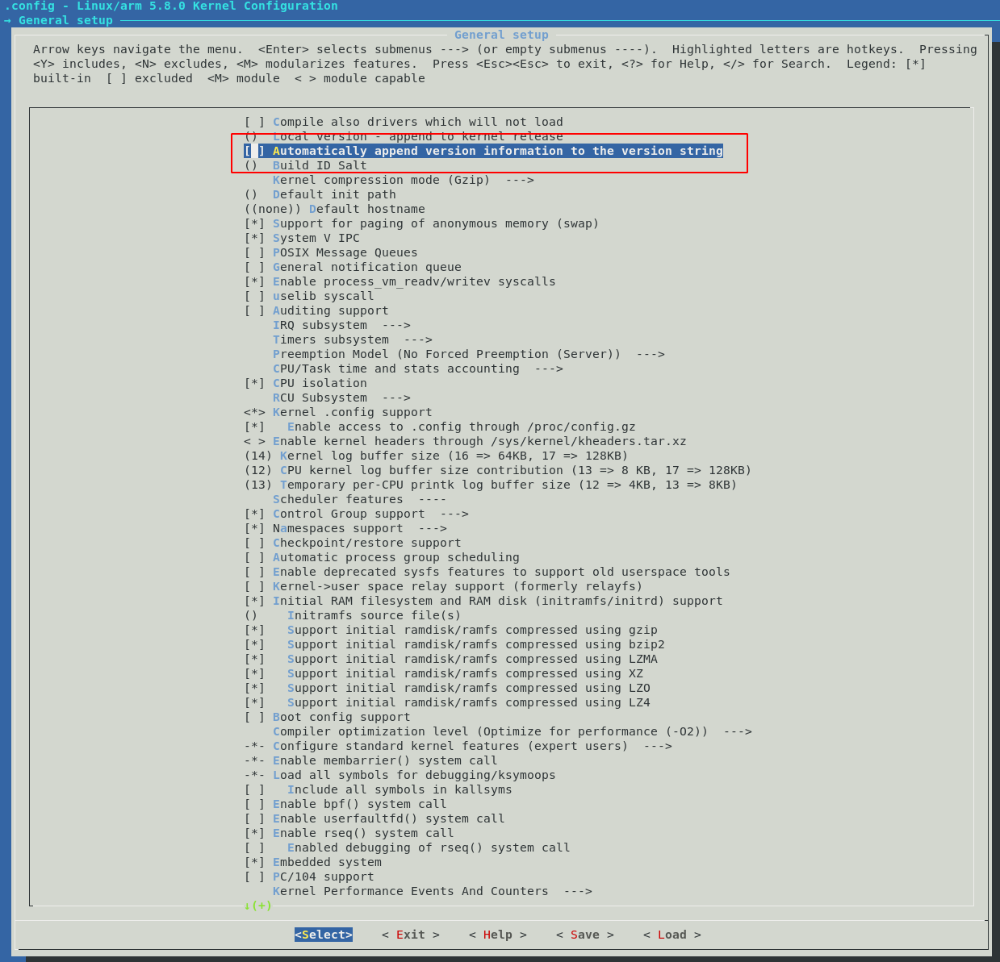
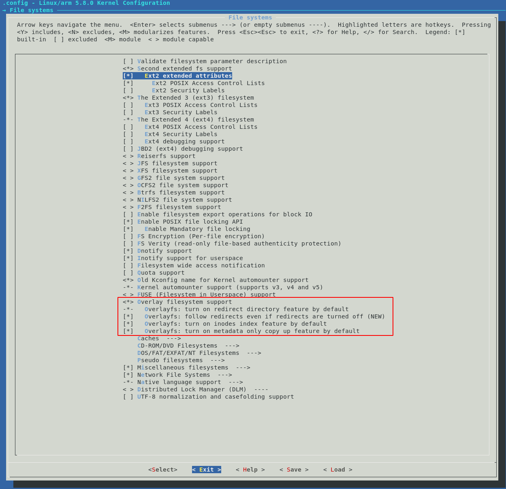
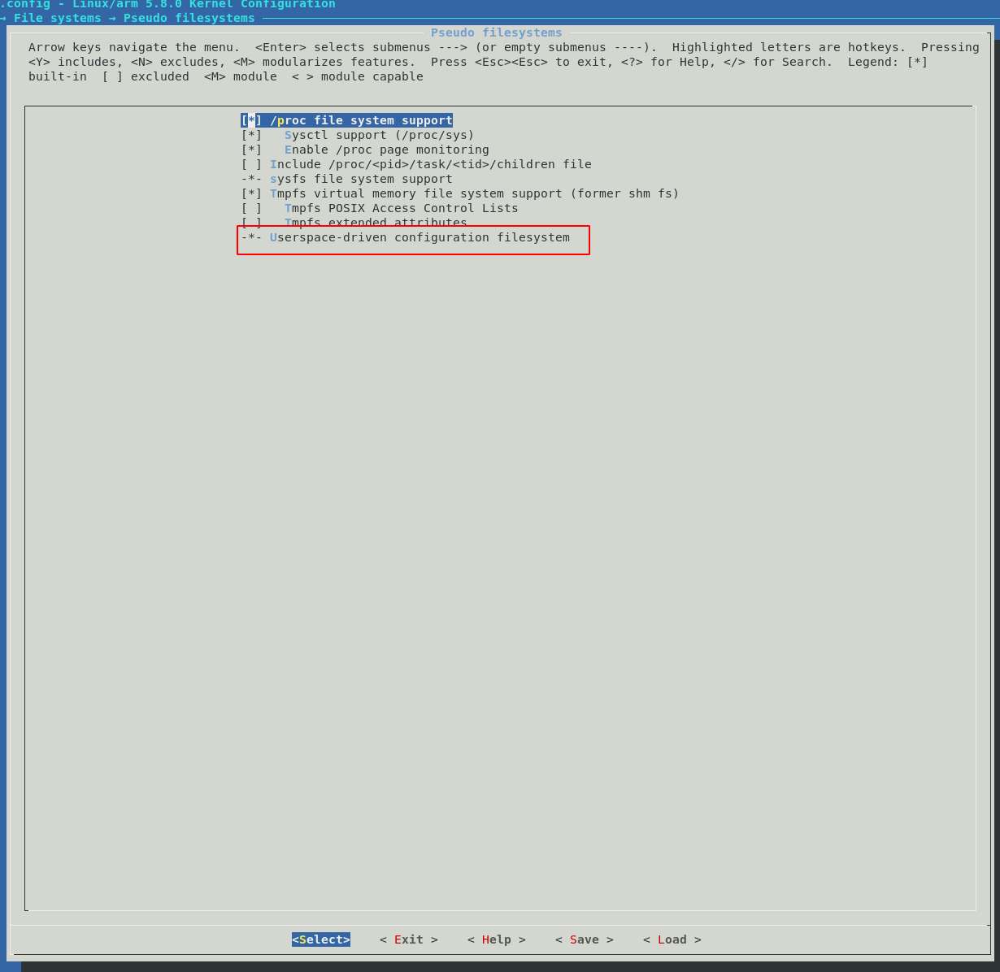

# קימפול ליבת המערכת (Linux Kernel)

[🔙 חזרה לתוכן העניינים של הלינוקס](../README.md)

במדריך זה נבנה את ליבת הלינוקס (Kernel) עבור כרטיס ה-DE10-Nano מאפס. ניקח את קוד המקור המעודכן, נגדיר את התצורה המותאמת ונרכיב את הכל בצורה נקייה ומסודרת.

---

## 🛠️ שלב ראשון: התקנת ספריות תלות

לפני שנוריד את קוד המקור, נדאג שלמחשב המארח יש את כל הכלים והספריות הנדרשים לקימפול הליבה.

הריצו את הפקודה הבאה בטרמינל:

```bash
sudo apt-get install libncurses-dev flex bison openssl libssl-dev dkms libelf-dev libudev-dev libpci-dev libiberty-dev libmpc-dev libgmp3-dev autoconf bc
```

---

## 📥 שלב שני: הורדת קוד המקור של הלינוקס

חברת Altera מתחזקת מזלג (Fork) ייעודי של הלינוקס התומך ברכיבי ה-SoC FPGA. נוריד את המאגר הרשמי ונבחר בגרסה מתקדמת ויציבה (`socfpga-6.7`) כדי להימנע מתקלות קוד ובעיות תאימות שהיו בגרסאות הישנות.

```bash
git clone https://github.com/altera-opensource/linux-socfpga.git

cd linux-socfpga

git checkout socfpga-6.7
```

---

## ⚙️ שלב שלישי: הגדרת תצורת הלינוקס (Kernel Configuration)


# הגדרת סביבת Cross Compilation עבור ARM

לפני שנריץ את פקודות ה־`make`, חובה להגדיר למערכת שאנחנו לא עובדים על המחשב הרגיל אלא מקמפלים עבור מעבד **ARM**.

אם לא נעשה זאת, המערכת תנסה לקמפל את ליבת הלינוקס עבור המחשב המארח (Host Machine), ונקבל שגיאות Assembler קשות.

## הגדרת משתני הסביבה

הריצו את הפקודות הבאות בטרמינל (פעם אחת לכל סשן):

```bash
export ARCH=arm
export CROSS_COMPILE=arm-linux-gnueabi-
```

## הסבר על הפקודות

### `export ARCH=arm`

מגדיר ל־`Makefile` שאנחנו מכוונים לארכיטקטורת **ARM** ולא לארכיטקטורה של המחשב המקומי.

### `export CROSS_COMPILE=arm-linux-gnueabi-`

מגדיר את הקומפיילר הצולב (**Cross Compiler**) שבו נשתמש כדי לבנות את ליבת הלינוקס עבור מעבד ARM.

לאחר הגדרת משתנים אלו, ניתן להמשיך להרצת פקודות ה־`make` עבור בניית הקרנל.

כדי שהלינוקס יכיר את החומרה של ה-DE10-Nano, ניצור תחילה קובץ הגדרות בסיסי מותאם:

```bash
make ARCH=arm socfpga_defconfig
```

# תיקון שגיאות קוד, קימפול הליבה והעתקה לכרטיס הזיכרון

[🔙 חזרה לתוכן העניינים של הלינוקס](../README.md)

לאחר שהגדרנו את תצורת הלינוקס (Menuconfig), עלינו לפתור מספר באגים בקוד המקור של Altera כדי שהקומפילציה תעבור בהצלחה. במדריך זה נבצע תיקון אוטומטי לקבצי המקור, נקמפל את ליבת המערכת ואת עץ ההתקנים (Device Tree), ונעביר את הקבצים המוכנים ישירות למחיצת ה-FAT בכרטיס ה-SD שלנו.

---

## 🛠️ שלב ראשון: תיקון אוטומטי של שגיאות הקוד

בגרסה הנוכחית של הלינוקס ישנם שני קבצים שגורמים לשגיאות קימפול:
1. דרייבר המסך של Newhaven (החסר במערכת).
2. משתנה `FBINFO_FLAG_DEFAULT` בדרייבר הווידאו של Altera שכבר אינו נתמך.

כדי לתקן אותם במהירות וללא צורך בעריכה ידנית, נוודא שאנחנו בתוך תיקיית המקור של הלינוקס (`linux-socfpga`) ונריץ את פקודות ה-`sed` הבאות:

```bash
# ביטול הדרייבר של Newhaven ב-Makefile
sed -i 's/obj-$(CONFIG_NEWHAVEN_LCD)/# obj-$(CONFIG_NEWHAVEN_LCD)/g' drivers/tty/Makefile

# איפוס דגל הווידאו השגוי בקובץ ה-C של Altera VIP
sed -i 's/info->flags = FBINFO_FLAG_DEFAULT;/info->flags = 0;/g' drivers/video/fbdev/altvipfb2.c


כעת נפתח את ממשק ההגדרות הגרפי (Menuconfig):

```bash
make ARCH=arm menuconfig
```

> 💡 **טיפ עבודה:** בכל שלב שבו צריך לערוך קבצים או לנהל קוד, מומלץ לעבוד בקלות ובנוחות ישירות דרך VS Code באמצעות הפקודה:
>
> ```bash
> code .
> ```
>
> במקום להשתמש ב־`nano`.

### שינויים נדרשים בתפריט ההגדרות

#### ביטול הוספת גרסה אוטומטית לשם הלינוקס

היכנסו ל־**General setup** ובטלו את האפשרות:

```
Automatically append version information to the version string
```



> פעולה זו עוזרת לנהל ולבדוק דרייברים שונים בקלות רבה יותר.

---

#### הפעלת תמיכה ב־Overlay Filesystem

היכנסו ל־**File systems** והפעילו:

- Overlay filesystem support
- כל אפשרויות המשנה שלה



> **חובה** אם תרצו לצרוב את ה־FPGA ישירות מתוך לינוקס בזמן ריצה.

---

#### הפעלת CONFIGFS

ודאו תחת:

```
File systems
    └── Pseudo filesystems
```

שהאפשרות הבאה מופעלת:

```
Userspace-driven configuration filesystem
```



---

לאחר שסיימתם לבצע את כל ההגדרות, נווטו באמצעות החיצים אל כפתור **Exit** עד ליציאה מהתפריט, ואשרו את שמירת השינויים (**Save**).

---

## 🚀 שלב רביעי: קימפול ליבת המערכת

> ⚠️ **הערה חשובה מאוד לגבי הרשאות:**  
> הימנעו מלהשתמש ב־`sudo make` בזמן הקימפול! שימוש ב־`sudo` מוחק או משנה את נתיבי משתני הסביבה של ה־Cross Compiler ועלול לגרום לשגיאות קריטיות.

### פתרון שגיאות Assembler נפוצות

במידה ואתם נתקלים במהלך הקימפול בשגיאות מסוג **Assembler errors** (הנובעות מכך שהקומפיילר ניסה בטעות לקמפל לארכיטקטורה שגויה), בצעו תחילה ניקוי עמוק של המערכת, והקפידו להגדיר מחדש ובאופן מדויק את הארכיטקטורה:

```bash
# ניקוי עמוק של קבצי קומפילציה קודמים
make mrproper

# יצירת קובץ ההגדרות מחדש בהגדרת ארכיטקטורה מדויקת
make ARCH=arm socfpga_defconfig
```

כעת, הריצו את פקודת הקימפול המלאה ליצירת קובץ ה־zImage (ניתן להתאים את מספר הליבות `-j` בהתאם לעוצמת המחשב המארח):

```bash
make ARCH=arm LOCALVERSION=zImage -j24
```

> תהליך הקימפול לוקח בדרך כלל בין **5 ל־10 דקות**.

---

## ✅ סיום

עם סיום התהליך בהצלחה, ייווצר עבורכם קובץ ליבת לינוקס דחוס ומוכן לשימוש.

קובץ הפלט נמצא בנתיב:

```text
arch/arm/boot/zImage
```